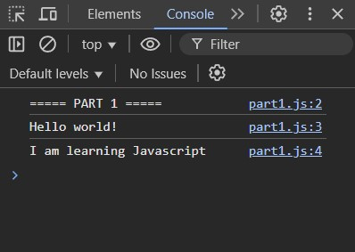

#  `12:15` PART 1 - INTRO
> [!IMPORTANT]
> * What is Javascript (JS)?
> * Why should I learn JS?
> * Adding JS to your HTML webpage
> * `console.log()`


### Tasks (20 min)
1. Create a HTML file `index.htm` with the headline: `Javascript 1 - Week 1`
2. Open the page and the *Developer Tools* and confirm the console output is empty.
3. Create a JS file `part1.js` which logs `Hello World!` and include it in your HTML.
4. Log a message *after*: `I am learning Javascript`
5. Log a message *before*: `===== PART 1 =====`
<details>
<summary>📸 Click to see screenshot</summary>


</details>
   

#### Bonus Tasks
1. Make the code work: 
    ```js
    console.log(Am I working?)
    ```
2. Log out a *warning* message: `Watch out I am new at JS!`
3. Log out an *error* message: `Oh no! Something went wrong D:`
<details>
<summary>📸 Click to see screenshot</summary>


</details>

# `13:00` PART 2 - VARIABLES
> [!IMPORTANT]
> * What are variables?
> * Declaring variables using `const` and `let`
> * Assigning values: `text`, `numbers`, and `yes/no`
> * `null` and `undefined`

### Tasks (30 min)
Let's pretend we were tasked to develop a site for a local pizzaria. We will start by first storing their information in some variables.
1. Add a new file `part2.js` which logs: `===== PART 2 =====` and include it in your HTML below the other
2. Improve the existing code:
```js
// Info about us
const Owner = 'Carlo';
const r = 'Bella Napoli';
const SPECIAL_OFFER! = "Pesto Pizza";
const desc = 'Experience the true Italian cuisine!';
const Nom Nom Street = 'Nom Nom Street 3, 2300 Copenhagen';
const opnTm = '10:00';
const clsTm = '23:00';
Console.log('Welcome to' r);
Console.log(desc);
console.log('Opening hours:', '10', -, '23');
```
3. They send us this additional information about them below. Lets try to extract the key informations into some variables too:
   > At Bella Napoli you can eat great italian food. We have vegan options but unfortunately you're not allowed to bring dogs or smoke. Contact us on +45 12 34 56 78 or write us an email at bella-napoli@hyf.com
4. Now we need a menu. Store some variables to capture the below options and their prices:
   * `Margherita Pizza` 90 DKK
   * `Pesto Pizza` 120 DKK
   * `Pepperoni Pizza` 120 DKK
   * `BBQ Chicken Pizza` 130 DKK
   * `White Pizza` 110 DKK
5. Print out the menu so it looks like below
<details>
<summary>📸 Click to see screenshot</summary>


</details>

6. The owner decided to temporarily remove the special offer. Let's update accordingly.


#### Bonus Tasks
1. The owner told us that they will add a new pizza: `Meat Lover's Pizza`. However, it seems like our code doesn't work. How can we use `'` in a text? 🤔❓
    ```js
    const pizza6 = 'Meat Lover's Pizza';
    const pizza6Price = 135;
    // TODO log pizza
    ```
2. The owner want to temporarily change the openings hours to `12:00 - 21:00`. Update the variables and log it as a *warning*: `OBS! Our new opening hours are: 12:00 - 21:00`


# `13:45` PAUSE (30 min)

# `14:15` PART 3 - TYPES
> [!IMPORTANT]
> * What are types and why should I care?
> * Simple types
> * Arrays
> * `typeof`


### Tasks (20 min)

<details>
<summary>Class exercise</summary>

```js
// guess what is logged from each line
console.log(typeof 3);
console.log(typeof -33);
console.log(typeof '3');
const threeConst = 3;
console.log(threeConst);
let threeLet = 3;
console.log(threeLet);
console.log(typeof 'console.log("console.log(console.log(""))")');
const names = ['benjamin', 'Christopher'];
console.log(typeof names[0]);
console.log(typeof names);
console.log(typeof true);
console.log(typeof names[2]);
```
</details>


1. Add a new file `part3.js` which logs: `===== PART 3 =====` and include it in your HTML below the others
2. The owner wants to change the name of the restaurant to `Carlo's Pizzaria`.
```js
owner = 'Carlo';
// calculate the new name of the restaurant and log it

// change the name of the owner and log the restaurant name again. What happened to the name of the restaurant and why?
owner = 'Maria'
```
3. Lets take the pizzas from the previous exercises, but this time try to store them all using two arrays: `pizzas` and `pizzaPrices` where the index of a pizza corresponds to the index of the prices.
4. Log the menu as before but looking up the values in the arrays
5. Let's add a price calculator. First lets store an order of 5 pizzas in a new array. Each order should just be the index of the pizza.
6. Calculate the total price of an order by adding the prices of each individual pizza. i.e. the order `0, 1, 1, 2, 4` should add up to 560 DKK. Log the order and total price like below. Hmm, how can we write the total price with 2 decimals? 🤔❓
<details>
<summary>📸 Click to see screenshot</summary>


</details>


#### Bonus Tasks
1. You get 20 % discount on the **first pizza** you order. Calculate a new discounted price and log it. 
2. Add another array which holds that the `Margherita Pizza`, `Pesto Pizza`, and `White pizza` are vegetarian. Change the name of the pizza to append `(v)` after the name if it is vegetarian. Log the updated menu.
<details>
<summary>📸 Click to see screenshot</summary>


</details>


# `15:00` PART 4 - OPERATORS
> [!IMPORTANT]
> * Comparison
>    * Equals / not equal
>    * Less than / greater than
> * Arithmetic
>    * Addition `+`
>    * subtraction `-`
>    * multiplication `*`
>    * division `/`
>    * Remainder `%`


### Tasks (30 min)
<details>
<summary>Class exercise</summary>

```js
// guess what is logged from each line
const employee = 'Carl';
const salary = 200;
const expenses = 20;
console.log(30 + 30 / 3);
console.log((10 + 10) * 2);
console.log(10 % 4);
console.log(salary === "200");
console.log(salary === 200);
console.log(salary == "200");
console.log(salary == 200);
console.log(salary - expenses);
console.log(salary < expenses);
console.log(salary >= salary);
```
</details>

1. Add a new file `part4.js` which logs: `===== PART 4 =====` and include it in your HTML below the others
2. Now we need to further expand on our price calculator. Lets first add a new order: `1, 2, 2` and calculate its total price without any discounts.
3. You get 20 % discount on the **first pizza** you order. Calculate the discount and the new discounted price and log it.
4. Let's add another variable `addPlasticBag`. It cost additional 5 DKK to add a plastic bag.
5. Now we also need to add the VAT which is 25 % on top of the discounted price. 

Let's test that the calculator works. We expect the following final prices:
   * order = `3, 4, 4`, with plastic bag = 421.25 DKK
   * order = `0, 0, 0`, no plastic bag = 315.00 DKK

#### Bonus Tasks
1. Extend the calculation with another feature, for example:
   * A 50 DKK delivery fee. Delivery is free for orders over 300 DKK.


# `15:45` QUESTIONS